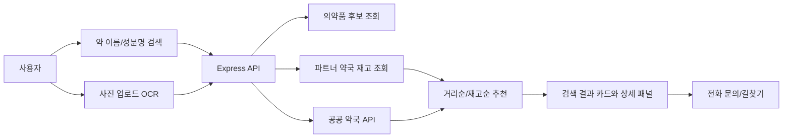

# PharmFinder MVP

약국 재고 정보를 소비자에게 빠르게 전달하기 위한 `React + Express` 기반 웹 서비스 MVP입니다. 사용자는 약 이름, 성분명, 사진 OCR, 위치 정보를 활용해 가까운 약국과 보유 재고를 확인할 수 있고, 약국 관리자는 파트너 약국 재고를 직접 수정할 수 있습니다.

## 프로젝트 목적

특정 의약품을 찾기 위해 약국마다 직접 전화하거나 방문해야 하는 불편을 줄이는 것이 목표입니다. 이 MVP는 의약품 판매나 예약을 직접 처리하지 않고, `재고 정보 전달`, `약국 연락`, `길찾기`, `방문 전 확인`에 초점을 맞춘 정보 제공형 서비스로 설계했습니다.

## 핵심 기능

- 약 이름 또는 성분명 기반 의약품 검색
- 사진 업로드 후 `Tesseract.js` OCR로 약품명 추출
- 사용자 위치 기반 가까운 파트너 약국 추천
- 재고 수량이 많은 약국 추천
- 약국별 재고 카드와 상세 슬라이드 패널
- 공공 약국 정보 새로고침 구조
- 약사/관리자용 재고 수정 화면
- 전화 문의 및 네이버 지도 길찾기 연결
- 정보 제공 중심의 법률 리스크 완화 문구
- 반응형 레이아웃과 hover/press 인터랙션

## 사용 기술

| 영역 | 기술 | 사용 이유 |
| --- | --- | --- |
| Frontend | React, Vite | 빠른 MVP 개발과 컴포넌트 기반 UI 구성 |
| Backend | Express | 검색, 재고 수정, 공공 API 중계용 경량 API 서버 |
| OCR | Tesseract.js | 외부 유료 Vision API 없이 사진 검색 흐름 구현 |
| API | Axios, 공공데이터포털 API | 의약품/약국 공공 데이터 연동 가능성 확보 |
| Data | JSON 파일 기반 파트너 약국 데이터 | DB 구축 전 MVP 단계에서 빠르게 검증 가능 |
| Deploy | Dockerfile, render.yaml | Render/Railway/Fly.io 같은 Node 호스팅에 배포 가능 |

## 서비스 흐름



## 실행 방법

```bash
npm install
npm run dev
```

기본 개발 서버:

- Frontend: `http://localhost:4173`
- Backend API: `http://localhost:8787`

배포용 빌드:

```bash
npm run build
npm run start
```

`npm run start`는 빌드된 프론트엔드와 API 서버를 함께 제공합니다.

## 환경 변수

`.env.example` 기준으로 아래 값을 사용할 수 있습니다.

```env
PUBLIC_DATA_SERVICE_KEY=
MFDS_SERVICE_KEY=
NMC_SERVICE_KEY=
PORT=8787
```

API 키가 없을 때는 seed 데이터와 파트너 약국 JSON 데이터를 기반으로 MVP 흐름을 확인할 수 있습니다.

## 현재 범위

- 이 버전은 의약품 판매/주문/예약 서비스가 아니라 `약국 재고 정보 전달` 중심 MVP입니다.
- 사용자에게 재고 참고 정보, 약국 연락처, 길찾기, 위치 기반 추천을 제공합니다.
- 실제 구매 가능 여부와 복약 상담은 약국 약사 확인을 전제로 합니다.
- 파트너 약국 데이터는 JSON 파일 기반이며, 실제 서비스에서는 DB와 POS/ERP 연동이 필요합니다.

## 개선 방향

- 파트너 약국 POS/ERP 연동
- 약국 관리자 인증 및 권한 관리
- PostgreSQL 기반 재고/검색 로그 저장
- OCR 정확도 개선 및 약 포장 이미지 인식 고도화
- 지도 API 기반 실시간 거리 계산과 영업 시간 필터
- 공공 API rate limit 대응 및 캐싱

## 문서

- 상세 기획 및 구현 전략: `docs/PRODUCT_PLAN.md`
